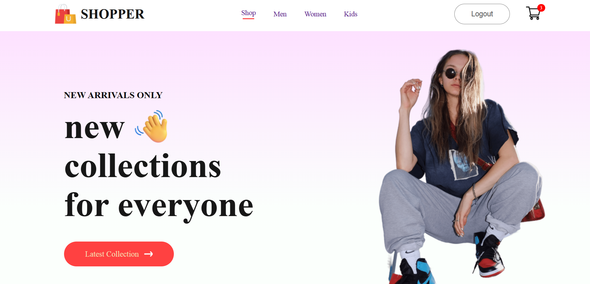
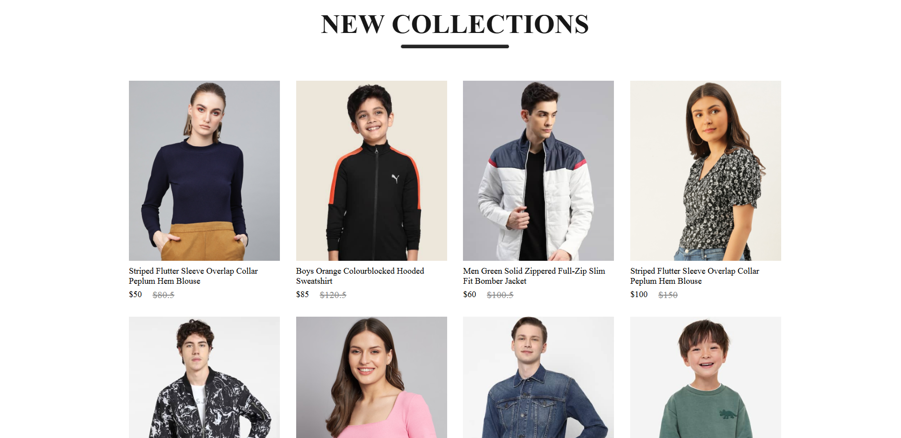
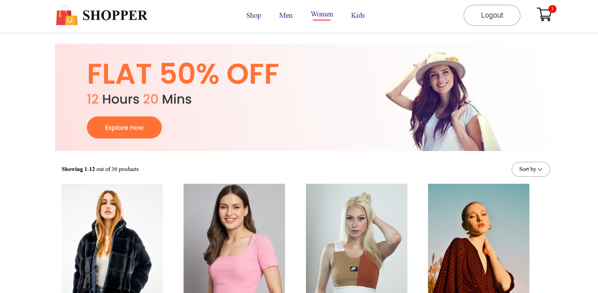
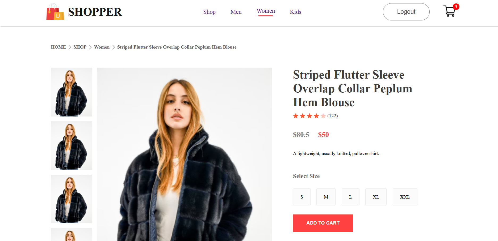
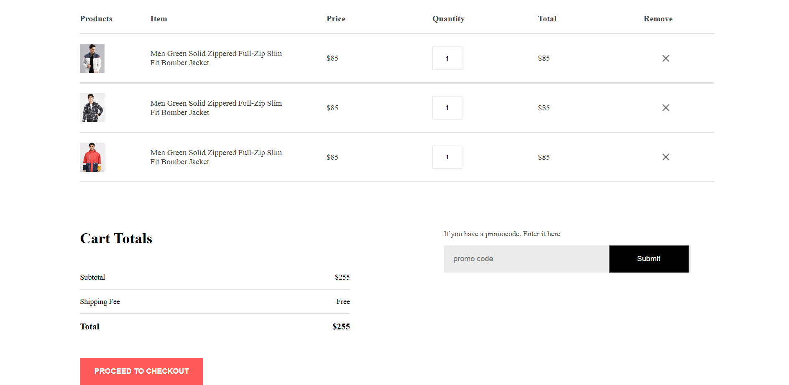
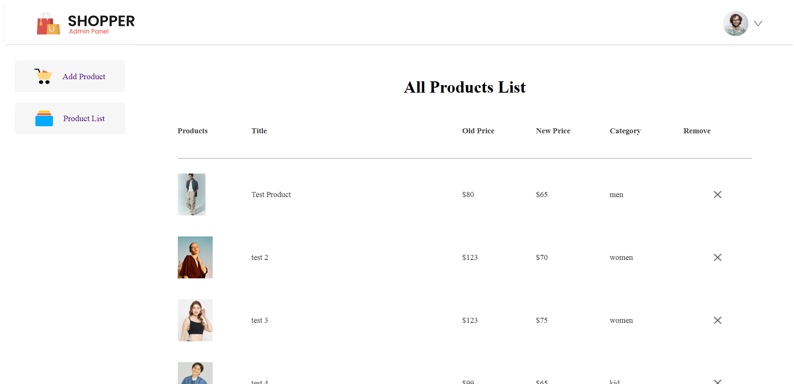
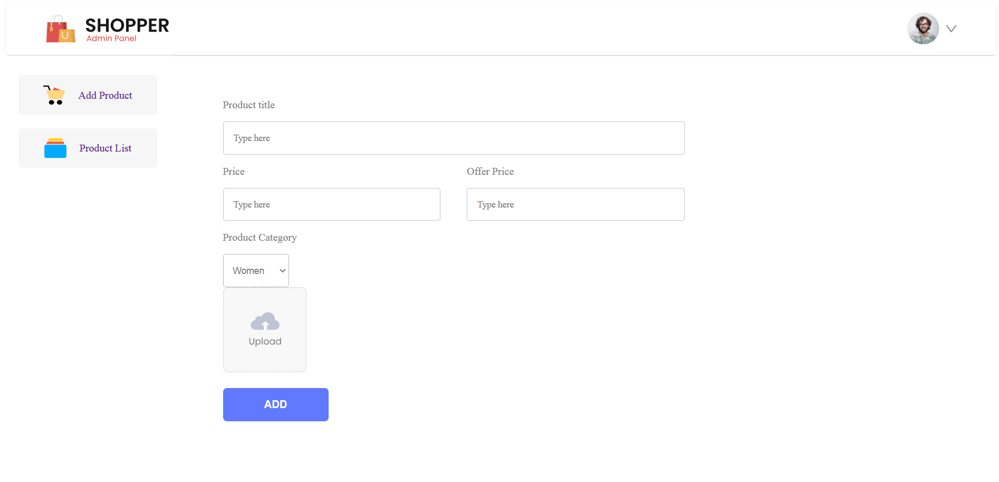

# Online Shop

This is a full-stack e-commerce web application developed using React JS for the front-end and Node.js, Express, and MongoDB for the back-end. The application includes user authentication, shopping cart functionality, order management, and an admin panel for product management.

## Project Structure

The application is divided into three main components:

- **Client:** The front-end application built with React JS.
- **Server:** The back-end application built with Node.js and Express.
- **Admin Panel:** An interface for administrators to manage products and orders.

## Features

### **Client**

- **User Authentication:**

  - User registration and login with secure authentication.
  - Password hashing using bcrypt and JWT for session management.

- **Shopping Cart:**

  - Add, view, and manage products in the shopping cart.
  - Global context for user and cart state management.

- **Product Listings:**
  - Display a list of products fetched from the server.
  - Dynamic image handling for product images and other visual content.

### **Server**

- **API Endpoints:**

  - Handle requests for user authentication, product management, and order processing.
  - Secure endpoints using JWT and bcrypt.

- **Database Management:**

  - Use MongoDB Atlas for storing user, product, and order data.

- **Image Uploads:**
  - Handle image uploads for product images using `multer`.
  - Store images in a specified directory or integrate with cloud storage.

**Email Notifications:**

  - Integrated SendGrid for handling email notifications.
  - SendGrid is used for sending subscription confirmation emails and other notifications.
  - To set up SendGrid, configure the API key in the server environment variables.

### **Admin Panel**

- **Product Management:**

  - Add, update, and delete products.
  - Manage product details including names, prices, and descriptions.
  - Upload and manage product images.

- **Order Management:**
  - View and manage customer orders.

## Technologies Used

- **Front-End:**

  - **React JS:** For building a dynamic and responsive user interface.
  - **React Context API:** For global state management of user data and cart contents.

- **Back-End:**
  - **Node.js and Express:** For server-side logic and API endpoints.
  - **MongoDB Atlas:** Cloud-based NoSQL database for storing user and product data.
  - **bcrypt:** For password hashing and security.
  - **jsonwebtoken (JWT):** For user authentication and authorization.
  - **multer:** For handling file uploads, such as product images.

## Installation and usage

**Clone respository:**

```
https://github.com/mehmedayt/online-shop.git
```

- To run client app
  <br/>

```
   cd client
   npm install
   npm run dev
```

- To run server app
  <br/>

```
   cd server
   npm install
   npm start
```

- To run admin app
  <br/>

```
   cd admin
   npm install
   npm run dev
```

## Image Gallery

### **Client Side**

Here are some screenshots of the client-side interface of the application:

1. **Home Page**
   

2. **New Collection**
    

3. **Product Listing**
   

4. **Product Details**
   

5. **Shopping Cart**
   

### **Admin Panel**

Below are screenshots of the admin panel, which is used to manage products and orders:

1. **All Products Page**
   

2. **Add Product Page**
   

## Contact

For any questions, feedback, or inquiries, please contact me at [mehmedayt8@gmail.com](mailto:mehmedayt8@gmail.com).

**Note:** The project is still under development. New features and improvements are being actively worked on, and updates will be provided as progress continues.
